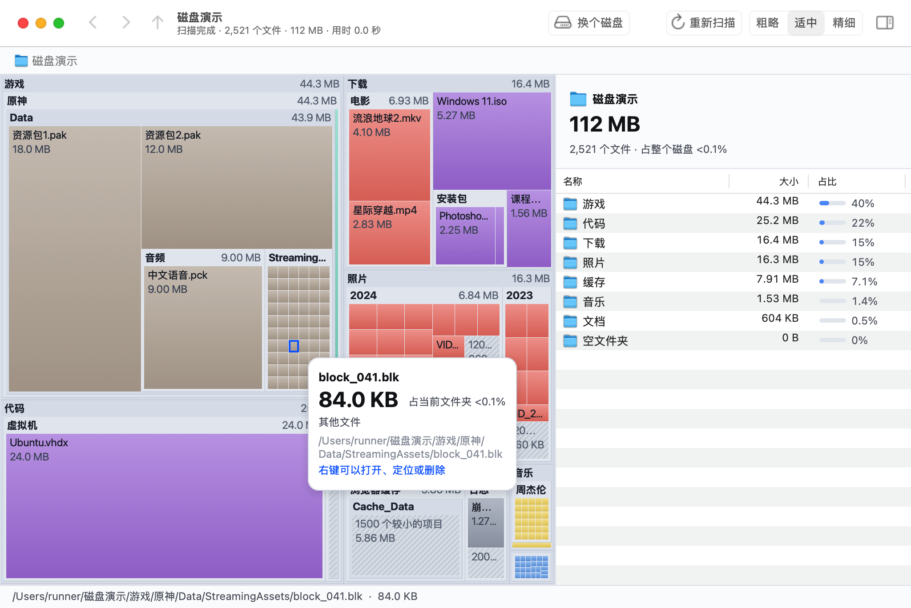

<p align="center"></p>

# DiskLens (文件清理助手)

Drive full again? Pick a drive and DiskLens scans it in seconds, drawing every folder and file as a block whose area matches its size. Double-click a folder to dive in, find what's actually eating your space, and right-click to send it to the Recycle Bin / Trash or delete it for good. Think SpaceSniffer: a portable app for Windows and macOS, no installation.

[中文说明](README.zh-CN.md) · [Download](https://github.com/haoawake/disk-lens/releases/latest)


## Features

- **Fast.** 32 threads in parallel: a C: drive on NVMe with 1.63 million files and 230 thousand folders scans in about 3 seconds.
- **Live treemap.** Blocks grow while the scan runs; folders still being scanned are marked.
- **Readable.** Files are colored by type (video, images, archives/disk images, programs…); files too small to draw are merged into one hatched block. Three detail levels.
- **Drill down.** Double-click to zoom into a folder, jump back via the breadcrumb, `Backspace` for the parent, `Alt + ←` (`⌘[` on a Mac) or the mouse back button to go back.
- **Native list.** An Explorer/Finder-style list on the right with system icons, sizes, share bars and file counts.
- **Delete in place.** Right-click → *Move to Recycle Bin* / *Move to Trash* or *Delete permanently* (permanent deletion asks you to tick a confirmation box first). The view updates immediately.
- **More access.** Windows: one click relaunches DiskLens elevated, so it sees restore points and other users' folders and can delete files with restrictive permissions. macOS: grant *Full Disk Access* to include Mail, Messages, the Trash and other apps' data.
- **Safe by default.** Drive roots, core Windows folders (System32, WinSxS…) and macOS system files can't be deleted; program folders, AppData, `/Applications`, `~/Library` and iCloud Drive get a warning first. Junctions and symbolic links are removed as links — DiskLens never follows them into their targets.
- **Correct on APFS.** On a Mac, sizes are the space actually allocated on disk; hard links count once, iCloud "optimized" files count as 0, the Data volume isn't counted twice when you scan *Macintosh HD*, and other mounted disks are skipped.
- **Portable.** Windows: a single ~3 MB executable, no installer, no registry entries, no background service. macOS: a native AppKit app (universal: Apple silicon and Intel).

## Usage

1. Download from [Releases](https://github.com/haoawake/disk-lens/releases/latest):
   - Windows 10/11: `DiskLens-win-x64.exe` (or `DiskLens-win-arm64.exe` for ARM PCs).
   - macOS 12 or later (Apple silicon or Intel): `DiskLens-mac-universal.zip`.
2. Windows: run it. If SmartScreen says "Windows protected your PC", click *More info* → *Run anyway*.
   macOS: unzip and drag *文件清理助手* into *Applications*. The app is not notarized, so the first time macOS refuses to open it: go to *System Settings → Privacy & Security*, click *Open Anyway* next to the message about 文件清理助手, and confirm (on macOS 14 and earlier you can also Control-click the app → *Open*). If macOS says the app is "damaged", run `xattr -cr "/Applications/文件清理助手.app"` in Terminal.
3. Click a drive, pick a folder, paste a path, or drag a folder onto the window (on a Mac, also onto the Dock icon or via *Open With* in Finder).
4. Hover a block for details, double-click to dive in, right-click for actions. Windows: `Delete` moves the selection to the Recycle Bin, `Shift + Delete` deletes it permanently. macOS: `⌘⌫` moves it to the Trash, `⌥⌘⌫` deletes it permanently.

Items in the Recycle Bin / Trash still occupy the drive until you empty it. If the drive is critically full, use *Delete permanently*.

On macOS, folders protected by the system's privacy controls (Mail, Messages, the Trash, other apps' containers) show as "no permission" until you turn on *Full Disk Access* for 文件清理助手 in *System Settings → Privacy & Security*; the app offers a button that opens that page. After an update you may need to toggle it again.

On APFS, files duplicated with Finder's *Duplicate* (and other copies made with `clonefile`) are clones that share their data with the original. Each one reports its full size, so a scan can add up to more than the drive actually uses, and deleting a single clone frees almost nothing. When that happens on a whole-drive scan, the side panel says how much was counted more than once.



## Building

Requires Go 1.26+.

```bash
go test ./...
bash scripts/build.sh 1.1.0       # writes dist/DiskLens-win-x64.exe etc.
bash scripts/build_mac.sh 1.1.0   # on a Mac with the Xcode command line tools: dist/DiskLens-mac-universal.zip
```

`go run .` also works for development (on Windows without the icon, DPI manifest and Common Controls v6, which the build script adds with go-winres). `go run . -bench C:\` (or `-bench /` on a Mac) scans without a window and prints the timing. The macOS UI is AppKit code in `*_darwin.m` and needs cgo.

## License

[MIT](LICENSE)
