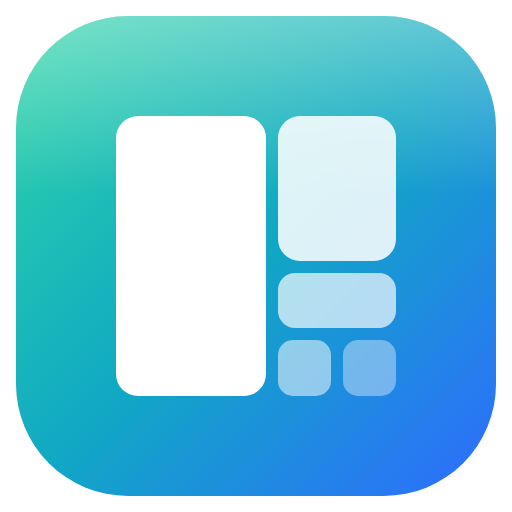
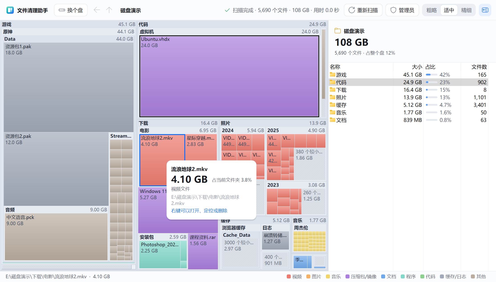
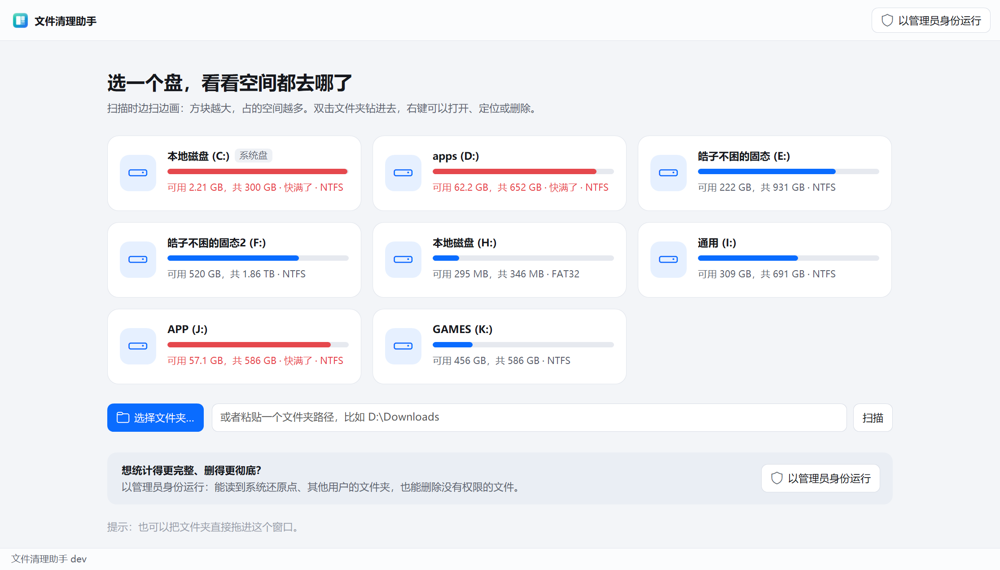

<p align="center"></p>

# 文件清理助手（DiskLens）

C 盘又红了？选一个盘，几秒钟扫完，所有文件夹和文件按大小画成一块块方块：方块越大，占的空间越多。双击文件夹钻进去，一路找到真正占地方的东西，右键直接移到回收站或者永久删除。用法和 SpaceSniffer 差不多，是一个独立的 Windows 小程序，不用安装。

[English](README.md) · [下载](https://github.com/haoawake/disk-lens/releases/latest)



## 特点

| | |
|---|---|
| **快** | 32 个线程同时扫。实测 NVMe 固态盘上的 C 盘：163 万个文件、23 万个文件夹，3 秒左右扫完。 |
| **边扫边画** | 不用等扫完，方块随着扫描实时长大；还在扫的文件夹标题上会写「扫描中」。 |
| **一眼看清** | 方块按文件类型上色（视频、图片、压缩包/镜像、程序……），小到画不下的文件合成一块斜线方块，不会糊成一片。 |
| **钻进去看** | 双击文件夹放大进去，顶上的路径可以随时跳回任意一层；`Backspace` 上一级，`Alt + ←` 后退，鼠标侧键也行。 |
| **右侧列表** | 和资源管理器一样的列表：系统图标、大小、占比条、文件数，按大小从大到小排好。 |
| **直接删** | 右键 →「移到回收站」或「永久删除」。删之前会说清楚有多大、在哪；永久删除要先勾选「我确定」。删完画面立刻更新，腾出了多少空间一目了然。 |
| **管理员模式** | 以管理员身份运行时，能统计到系统还原点、其他用户的文件夹；永久删除也能删掉只读的、权限设得很死的文件。 |
| **不会误伤** | 整个磁盘、Windows 系统文件夹、System32 这些删了就开不了机的地方直接拦下；软件目录、AppData 里的东西会先提醒。目录联接（junction）、符号链接只删链接本身，绝不顺着删到别的地方。 |
| **免安装** | 一个 3 MB 左右的程序，双击就用，不写注册表，不留后台。 |

## 怎么用

1. **下载**（[Releases 页面](https://github.com/haoawake/disk-lens/releases/latest)）

   | 电脑 | 下载这个 |
   |---|---|
   | Windows 10 / 11 | `DiskLens-win-x64.exe` |
   | 骁龙等 ARM 电脑 | `DiskLens-win-arm64.exe` |

2. **双击运行。** 第一次运行如果提示「Windows 已保护你的电脑」：点「更多信息」→「仍要运行」。

3. **点一个盘**（或者「选择文件夹…」、粘贴一个路径、把文件夹拖进窗口），马上开始扫描。

4. **找大块头：**
   - 鼠标指着方块，能看到它多大、占当前文件夹百分之几、完整路径；
   - 双击文件夹钻进去，双击文件跳到它所在的文件夹；
   - 右键：打开、在资源管理器中显示、复制路径、属性、重新扫描这个文件夹、移到回收站、永久删除；
   - 选中后按 `Delete` 移到回收站，`Shift + Delete` 永久删除。

5. **想删得更彻底：** 点顶栏的「管理员」，程序会以管理员身份重新打开并接着扫同一个位置。

> 回收站里的东西仍然占着这个盘的空间，清空回收站后才会真正腾出来。C 盘告急时请直接用「永久删除」。



## 常见问题

**为什么扫描到的总大小比磁盘「已用空间」小？**
有些地方普通程序读不到：系统还原点（`System Volume Information`）、其他用户的文件夹等。扫描整个盘时，右侧会写明差了多少；以管理员身份运行可以统计到大部分。

**`hiberfil.sys`、`pagefile.sys` 很大，能删吗？**
不能直接删，它们一直被系统占用着（删也会提示「正被使用」）。`hiberfil.sys` 是休眠文件，不用休眠的话，以管理员身份打开命令提示符运行 `powercfg /h off` 就会自动消失；`pagefile.sys` 是虚拟内存，可以在「系统 → 高级系统设置 → 性能 → 高级 → 虚拟内存」里调小或挪到别的盘。

**哪些东西通常可以放心删？**
`下载` 文件夹里的安装包和镜像、`AppData\Local\Temp` 里的临时文件、各种软件的缓存（文件夹名一般带 Cache），以及回收站（`$Recycle.Bin`）。软件安装目录（`Program Files`）里的东西请用「设置 → 应用」卸载，别直接删。

**有的文件删不掉？**
删除结束后会列出删不掉的文件和原因。「正被其他程序使用」：关掉对应程序再删一次；「没有权限」：以管理员身份运行后再删。

**机械硬盘、移动硬盘扫得慢？**
机械硬盘要来回寻道，速度主要受硬盘本身限制，几十万个文件可能要几分钟。扫描过程中随时可以看、可以停。

**OneDrive 里「仅在线」的文件算多大？**
算 0。它们没有下载到电脑上，不占这台电脑的空间。

## 从源码构建

需要 Go 1.26 或更新版本。

```bash
go test ./...
bash scripts/build.sh 1.0.0   # 生成 dist/DiskLens-win-x64.exe 等
```

开发时直接 `go run .` 也能打开窗口，只是没有程序图标、高分屏声明和新版系统控件（确认框会退化成普通消息框），这些由构建脚本用 go-winres 加上。`go run . -bench C:\` 只扫描不开窗口，打印用时。

## 许可

[MIT](LICENSE)
